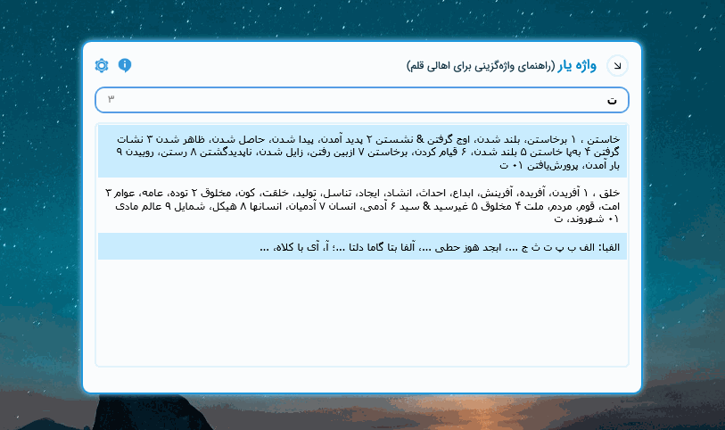

# Vajehyar

**[برنامه را از اینجا دانلود کنید](https://github.com/kokabi1365/Vajehyar/releases/latest)**

Using paper dictionaries for day-to-day looking up of words is a nightmare. Vajehyar is a minimal, intuitive and efficient dictionary to find synonyms of Persian words in real time. **It is the first and largest Persian-language thesaurus dictionary.** All you need to do is downloading [latest release](https://github.com/kokabi1365/Vajehyar/releases) and find whatever you want among **183,000** words.

Vajehyar designed to be fast and lightweight and It uses two popular dictionaries as its core database:

1. **A Comprehensive Dictionary of Persian Synonyms & Antonyms****, written by farajollah khodaparasti with more than 135000 thousand words;
2. [**The Thesaurus of Persian Words**](https://fa.wikipedia.org/wiki/%D9%81%D8%B1%D9%87%D9%86%DA%AF_%D8%B7%DB%8C%D9%81%DB%8C)**, written by Jamshyd Fararooy with around 45,000 words.

## Installation & Usage

This application is portable and tries to remain so. For launching app just press **Alt+Shift+V** from anywhere in windows and press **Esc** to minimize app to tray. You can change this shortcut from settings.

**Please note that on Windows lower than Windows 10 you have to install [.net 4.6 or above](https://www.microsoft.com/en-us/download/details.aspx?id=53344).**

## Contributing

I welcome anyone to contribute to this project for fixing bugs or add new features, but I hope you be kind enough to avoid simply changing donation link and republish for yourself or worse than that sell it as a commercial app. That's not why I'm sharing the source code, at all.

---
**You can support me by [donating via IDPay](https://idpay.ir/kokabi)**

[توضیحات فارسی در ویرگول](https://virgool.io/@kokabi/vajehyar-bgyys49ibopb)

